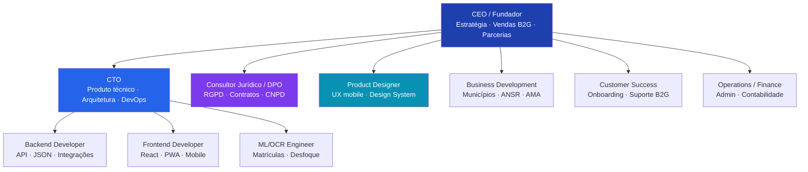
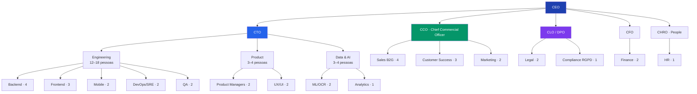

# Organograma — OBOM

Estrutura organizacional da OBOM em duas fases: **startup (0–10 pessoas)** e **escala (20–50 pessoas)**.

---

## Fase 1 — Startup (0–10 colaboradores)

Foco: MVP, piloto B2G, conformidade RGPD, primeiros contratos municipais.

### Responsabilidades — Fase Startup

| Cargo | Responsabilidades |
|-------|-------------------|
| **CEO / Fundador** | Visão, fundraising, vendas institucionais, relação ANMP/AMA, decisões estratégicas |
| **CTO** | Arquitetura Next.js, segurança, infra cloud, roadmap técnico, contratação dev |
| **Backend Developer** | API routes, JSON autoridades, base de dados, integrações SI municipais |
| **Frontend Developer** | App PWA, câmera, geolocalização, componentes React, acessibilidade |
| **ML/OCR Engineer** | Reconhecimento matrículas PT/EU, desfoque rostos, otimização mobile |
| **Consultor Jurídico / DPO** | Conformidade RGPD, DPIA, registo CNPD, contratos B2G, pareceres legais |
| **Product Designer** | Design system, fluxos mobile, testes utilizador, protótipos Figma |
| **Business Development** | Prospeção municípios, demos, propostas comerciais, feiras govtech |
| **Customer Success** | Onboarding municípios, formação, SLA, feedback produto |
| **Operations / Finance** | Faturação, contratos admin, RH, reporting financeiro |

---

## Fase 2 — Escala (20–50 colaboradores)

Foco: multi-tenant, expansão nacional, módulos B2B (seguradoras, frotas), equipa comercial.

### Departamentos — Fase Escala

#### Tecnologia (CTO) — ~18 pessoas

| Equipa | Headcount | Missão |
|--------|-----------|--------|
| Backend | 4 | APIs, multi-tenant, integrações ANSR/municípios |
| Frontend | 3 | Dashboard municipal, app cidadão, admin |
| Mobile | 2 | PWA nativa, performance câmera |
| DevOps/SRE | 2 | Infra, CI/CD, monitorização, SLA 99.9% |
| QA | 2 | Testes automatizados, conformidade |
| Product | 4 | PMs + UX — roadmap, discovery B2G |
| Data & AI | 3 | OCR matrículas EU, desfoque, analytics |

#### Comercial (CCO) — ~9 pessoas

| Equipa | Headcount | Missão |
|--------|-----------|--------|
| Sales B2G | 4 | Municípios, ANSR, contratos públicos |
| Customer Success | 3 | Retention, NPS, expansão contas |
| Marketing | 2 | Conteúdo govtech, eventos, brand |

#### Legal & Compliance (CLO/DPO) — ~3 pessoas

| Função | Missão |
|--------|--------|
| Legal | Contratos públicos, licitações, IP |
| Compliance RGPD | CNPD, DPIA, auditorias, formação interna |

#### Administração — ~4 pessoas

| Função | Missão |
|--------|--------|
| CFO + Finance | Fundraising, reporting, unit economics |
| CHRO + HR | Cultura, recrutamento, políticas |

---

## Matriz RACI — Decisões críticas

| Decisão | CEO | CTO | CLO/DPO | CCO |
|---------|-----|-----|---------|-----|
| Modelo de pricing B2G | A | C | I | R |
| Conformidade RGPD | I | C | A/R | I |
| Formato JSON autoridades | I | A/R | C | I |
| Contrato piloto município | A | I | R | R |
| Roadmap produto | A | R | C | C |
| Pivot de modelo negócio | A | C | R | C |

*R = Responsible · A = Accountable · C = Consulted · I = Informed*

---

## Cultura e valores

1. **Conformidade primeiro** — RGPD não é opcional
2. **Transparência cívica** — Tecnologia a serviço do interesse público
3. **Mobile-first** — O cidadão denuncia no momento, no local
4. **Dados mínimos** — Recolher só o necessário, reter o mínimo tempo
5. **Parceria institucional** — Trabalhar com autoridades, não contra elas

---

## Evolução headcount

| Fase | Pessoas | ARR alvo |
|------|---------|----------|
| Seed (MVP) | 3–5 | €0 |
| Piloto | 6–10 | €20k |
| Série A | 20–30 | €200k |
| Escala | 40–50 | €500k+ |
